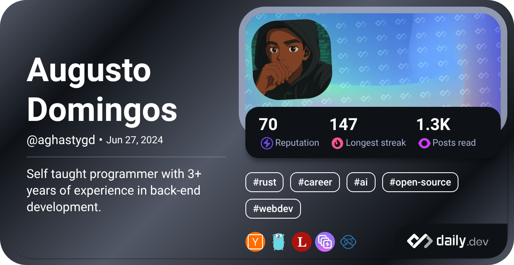

    <h1 align="center">Olá 👋, Eu sou Augusto Domingos</h1>
    
    
  

    <h3 align="center">Um programador autodidata de Moçambique</h3>
    <a href="README.md" align="center"><em>Read in English</em></a>

---

<h3 align="left">Sobre Mim:</h3>

Sou um desenvolvedor de software moçambicano com grande interesse em construir software confiável e entender como as coisas funcionam por trás das cortinas.

Grande parte da minha experiência profissional é voltada para o desenvolvimento backend, criando APIs, projetando serviços e resolvendo problemas reais através de software. Python tem sido minha principal ferramenta durante anos, mas o que realmente me motiva na programação não é uma linguagem específica — é compreender sistemas e descobrir formas de torná-los melhores.

Com o tempo, meus interesses foram além do desenvolvimento web e passaram a incluir arquitetura de software, Linux, redes de computadores, programação de sistemas, aplicações desktop e open-source. Atualmente, passo boa parte do meu tempo explorando Rust, estudando sistemas operacionais, experimentando novas ideias e trabalhando em projetos que me desafiam a aprender algo novo.

Gosto de criar software do zero, mas também gosto de estudar bases de código existentes e contribuir para os projetos que utilizo. Tive a oportunidade de contribuir para a Fyrox game engine e continuo aprendendo com as comunidades de open-source que tornam possível grande parte da tecnologia que usamos todos os dias.

Além da programação, escrevo artigos técnicos, produzo conteúdo sobre tecnologia e compartilho o que aprendo com outros desenvolvedores. Um dos meus objetivos pessoais é ajudar a tornar a tecnologia mais acessível e visível dentro da comunidade moçambicana.

Tenho um interesse especial em entender como o software funciona internamente, seja uma aplicação web, um ambiente desktop Linux, uma engine de jogos, um protocolo de rede ou um emulador.

---

## Projetos Atuais

* **Lazy Ninja** — uma biblioteca para Django que gera automaticamente endpoints de API, schemas, documentação e SDKs de clientes a partir de modelos Django, construída sobre Django Ninja.
* **Wiretray** — uma aplicação desktop open source para Linux, desenvolvida em Rust, focada em gerenciamento de hotspots

---

## Áreas de Interesse

* Engenharia Backend
* Arquitetura de Software
* Software Livre
* Engenharia Reversa
* Emulação
* Engines de Jogos
* Programação Gráfica

 

---

    <h2>Meu cartão Dev:</h2>
    

---

    <h2 align="left">Minhas redes sociais:</h2>
    

        <a href="https://www.linkedin.com/in/augusto-domingos-31801519a" target="_blank" rel="noreferrer"> &nbsp;&nbsp;</a>
        <a href="https://www.instagram.com/aghasty_gd/" target="_blank" rel="noreferrer"> &nbsp;&nbsp;</a>
        <a href="https://web.facebook.com/augusto.domingos.549/" target="_blank" rel="noreferrer"> &nbsp;&nbsp;</a>
        <a href="https://www.youtube.com/@aghastygdproductions/" target="_blank" rel="noreferrer"> &nbsp;&nbsp;</a>
    

---

 
    <h3>Linguagens e Ferramentas:</h3>
    

---

<h2>Estatísticas:</h2>
    

